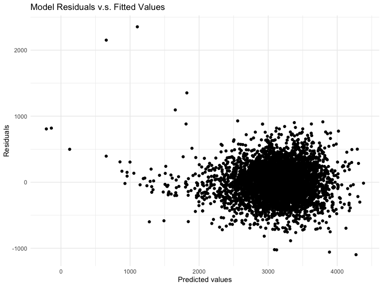
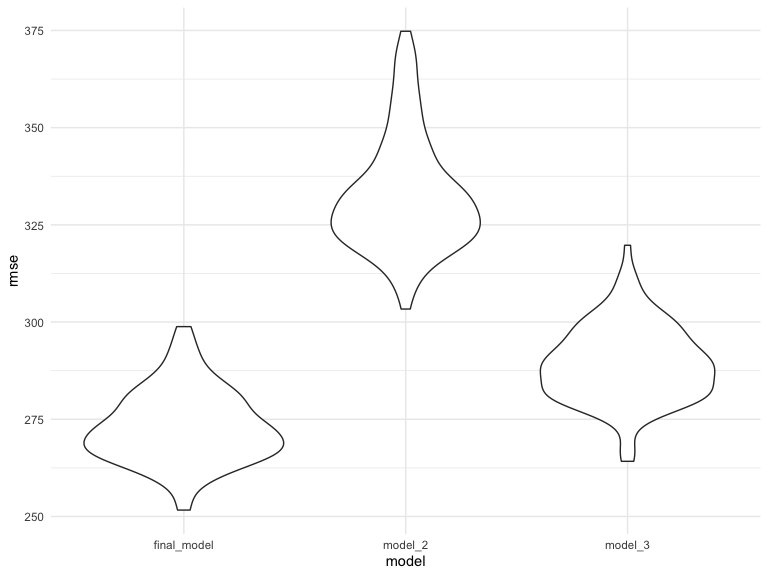
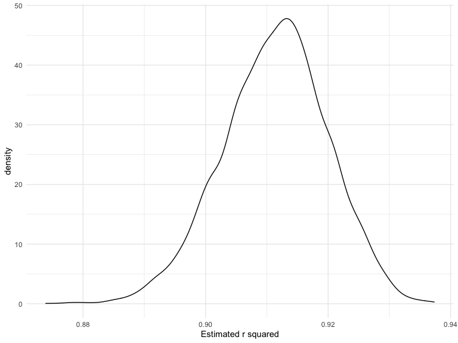
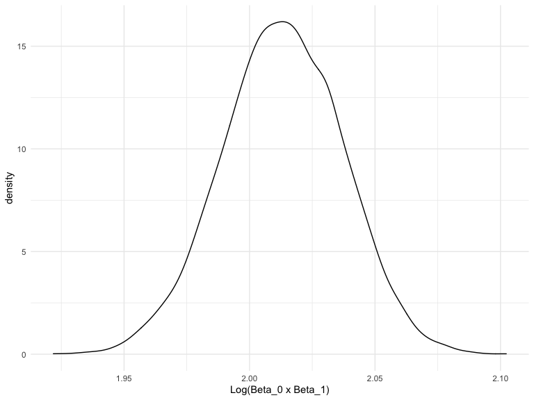

HW6
================

This is my response to HW 6:

### Problem 1

We start off by downloading the data from The Washing Post, on on
homicides in 50 large U.S. cities via Github. After taking a look at the
dataset, we also created city\_state variable and a binary variable
indicating whether the homicide is solved.

``` r
homicide_df =
  read.csv(url("https://raw.githubusercontent.com/washingtonpost/data-homicides/master/homicide-data.csv")) %>%
  janitor::clean_names() 

skimr::skim(homicide_df)
```

|                                                  |              |
| :----------------------------------------------- | :----------- |
| Name                                             | homicide\_df |
| Number of rows                                   | 52179        |
| Number of columns                                | 12           |
| \_\_\_\_\_\_\_\_\_\_\_\_\_\_\_\_\_\_\_\_\_\_\_   |              |
| Column type frequency:                           |              |
| character                                        | 9            |
| numeric                                          | 3            |
| \_\_\_\_\_\_\_\_\_\_\_\_\_\_\_\_\_\_\_\_\_\_\_\_ |              |
| Group variables                                  | None         |

Data summary

**Variable type: character**

| skim\_variable | n\_missing | complete\_rate | min | max | empty | n\_unique | whitespace |
| :------------- | ---------: | -------------: | --: | --: | ----: | --------: | ---------: |
| uid            |          0 |              1 |   9 |  10 |     0 |     52179 |          0 |
| victim\_last   |          0 |              1 |   1 |  20 |     0 |     12687 |          0 |
| victim\_first  |          0 |              1 |   1 |  28 |     0 |     16640 |          0 |
| victim\_race   |          0 |              1 |   5 |   8 |     0 |         6 |          0 |
| victim\_age    |          0 |              1 |   1 |   7 |     0 |       102 |          0 |
| victim\_sex    |          0 |              1 |   4 |   7 |     0 |         3 |          0 |
| city           |          0 |              1 |   5 |  14 |     0 |        50 |          0 |
| state          |          0 |              1 |   2 |   2 |     0 |        28 |          0 |
| disposition    |          0 |              1 |  14 |  21 |     0 |         3 |          0 |

**Variable type: numeric**

| skim\_variable | n\_missing | complete\_rate |        mean |         sd |          p0 |         p25 |         p50 |         p75 |         p100 | hist  |
| :------------- | ---------: | -------------: | ----------: | ---------: | ----------: | ----------: | ----------: | ----------: | -----------: | :---- |
| reported\_date |          0 |              1 | 20130899.16 | 1123419.63 | 20070101.00 | 20100318.00 | 20121216.00 | 20150911.00 | 201511105.00 | ▇▁▁▁▁ |
| lat            |         60 |              1 |       37.03 |       4.35 |       25.73 |       33.77 |       38.52 |       40.03 |        45.05 | ▁▅▅▇▅ |
| lon            |         60 |              1 |     \-91.47 |      13.75 |    \-122.51 |     \-96.00 |     \-87.71 |     \-81.76 |      \-71.01 | ▃▁▃▇▅ |

``` r
homicide_df$city_state= 
  paste(homicide_df$city,",", homicide_df$state)

#drop certain cities
homicide_df = 
  homicide_df %>%
    filter(!(city_state %in% c("Dallas , TX", "Phoenix , AZ", "Kansas City , MO", "Tulsa , AL"))) %>% 
#drop rows not containing white or black in victim_race
  filter(victim_race == "White" | victim_race == "Black") %>%
#relevel the races
   mutate(
    victim_race=fct_relevel(victim_race, "White"),
#create a binary resolved variable
  resolved = as.numeric(disposition == 'Closed by arrest'), 
         victim_age=as.numeric(victim_age)) #change victim age as numeric
```

For the city of Baltimore, MD…

``` r
baltimore_df = 
  homicide_df %>%
  filter(city == "Baltimore") %>%
  dplyr::select(resolved, victim_age, victim_sex, victim_race)
```

using glm function to fit a logistic regression with resolved vs
unresolved as the outcome and victim age, sex and race as predictors.

``` r
fit_logistic = 
  baltimore_df %>%
  glm(resolved ~victim_age + victim_race + victim_sex, data =.,
      family = binomial()) %>%
  broom::tidy()
```

Obtaining the estimate, OR, CI of OR for solving homicides comparing
non-white victims to white victims keeping all other variables fixed:

``` r
fit_logistic %>%
  mutate(OR = exp(estimate)) %>%
#add CI
  group_by(term) %>%
  mutate(
    ci_lower = exp(estimate - std.error * 1.96),
    ci_upper =  exp(estimate + std.error * 1.96)) %>%
  dplyr::select(term, log_OR = estimate, OR, ci_lower, ci_upper, p.value) %>% 
  knitr::kable(digits = 3)
```

| term              | log\_OR |    OR | ci\_lower | ci\_upper | p.value |
| :---------------- | ------: | ----: | --------: | --------: | ------: |
| (Intercept)       |   1.152 | 3.164 |     1.989 |     5.031 |   0.000 |
| victim\_age       | \-0.007 | 0.993 |     0.987 |     1.000 |   0.043 |
| victim\_raceBlack | \-0.842 | 0.431 |     0.306 |     0.607 |   0.000 |
| victim\_sexMale   | \-0.854 | 0.426 |     0.325 |     0.558 |   0.000 |

Interpretation: Homicides in which the victim is black are substantially
less likely to be resolved that those in which the victim is white.
Homicides in which the victim is male are significantly less like to be
resolved than those in which the victim is female.The effect of age is
statistically significant, and should be studied further.

Now run glm for each of the cities in your dataset, and extract the
adjusted odds ratio (and CI) for solving homicides comparing Black
victims to white victims. Do this within a “tidy” pipeline, making use
of purrr::map, list columns, and unnest as necessary to create a
dataframe with estimated ORs and CIs for each city.

``` r
glm_cities =
  homicide_df %>% 
  group_by(city_state) %>%
  dplyr::select(city_state, resolved, victim_age, victim_sex, victim_race) %>%
  nest(data = -city_state) %>%
  mutate(
    models = map(data, ~glm(resolved ~victim_age + victim_race + victim_sex, data =.x, family = binomial)),
    results = map(models, broom::tidy)) %>% 
  dplyr::select(-data, -models) %>% 
  unnest(results) %>%
#add CI, OR
  group_by(term) %>%
  mutate(
    ci_lower = exp(estimate - std.error * 1.96),
    ci_upper =  exp(estimate + std.error * 1.96),
    OR = exp(estimate)) %>%
  dplyr::select(city_state, term, log_OR = estimate, OR, ci_lower, ci_upper, p.value) %>%
  filter(term == "victim_raceBlack") %>% 
  mutate(city_state = forcats::fct_reorder(factor(city_state), OR)) 
```

Create a plot that shows the estimated ORs and CIs for each city.
Organize cities according to estimated OR, and comment on the plot.

``` r
glm_cities  %>% 
  ggplot(aes(x = city_state, y = OR)) +
  geom_point(size=5) + 
  geom_errorbar(aes(x=city_state, ymin = ci_lower, ymax = ci_upper)) +
  theme(text = element_text(size = 8), axis.text.x = element_text(angle = 60, hjust = 1)) + 
   #Add the title and the name for x and y axis. 
  labs(
    title = "OR estimation of unsolved black homicides by city, state",
    x = "City, State",
    y = "Estimation of OR of unsolved Black homicides"
  )
```


Based on the graph above, Boston, MA had the lowest odds ratio compared
to other major cities, meanwhile, Tampa, Florida had the highest odds
ratio of unsolved black homicides. This graph illustrates the odds of
solving homicides in 50 major cities significantly differ based on
victim’s race.

### Problem 2

Import data & load and clean the data for regression analysis

``` r
bw=
  read.csv("./birthweight.csv") %>%
  janitor::clean_names() %>%
   mutate(babysex = as.factor(babysex),
          malform = as.factor(malform),
          mrace = as.factor(mrace),
          frace = as.factor(frace))
skimr::skim(bw)
```

|                                                  |      |
| :----------------------------------------------- | :--- |
| Name                                             | bw   |
| Number of rows                                   | 4342 |
| Number of columns                                | 20   |
| \_\_\_\_\_\_\_\_\_\_\_\_\_\_\_\_\_\_\_\_\_\_\_   |      |
| Column type frequency:                           |      |
| factor                                           | 4    |
| numeric                                          | 16   |
| \_\_\_\_\_\_\_\_\_\_\_\_\_\_\_\_\_\_\_\_\_\_\_\_ |      |
| Group variables                                  | None |

Data summary

**Variable type: factor**

| skim\_variable | n\_missing | complete\_rate | ordered | n\_unique | top\_counts                     |
| :------------- | ---------: | -------------: | :------ | --------: | :------------------------------ |
| babysex        |          0 |              1 | FALSE   |         2 | 1: 2230, 2: 2112                |
| frace          |          0 |              1 | FALSE   |         5 | 1: 2123, 2: 1911, 4: 248, 3: 46 |
| malform        |          0 |              1 | FALSE   |         2 | 0: 4327, 1: 15                  |
| mrace          |          0 |              1 | FALSE   |         4 | 1: 2147, 2: 1909, 4: 243, 3: 43 |

**Variable type: numeric**

| skim\_variable | n\_missing | complete\_rate |    mean |     sd |      p0 |     p25 |     p50 |     p75 |   p100 | hist  |
| :------------- | ---------: | -------------: | ------: | -----: | ------: | ------: | ------: | ------: | -----: | :---- |
| bhead          |          0 |              1 |   33.65 |   1.62 |   21.00 |   33.00 |   34.00 |   35.00 |   41.0 | ▁▁▆▇▁ |
| blength        |          0 |              1 |   49.75 |   2.72 |   20.00 |   48.00 |   50.00 |   51.00 |   63.0 | ▁▁▁▇▁ |
| bwt            |          0 |              1 | 3114.40 | 512.15 |  595.00 | 2807.00 | 3132.50 | 3459.00 | 4791.0 | ▁▁▇▇▁ |
| delwt          |          0 |              1 |  145.57 |  22.21 |   86.00 |  131.00 |  143.00 |  157.00 |  334.0 | ▅▇▁▁▁ |
| fincome        |          0 |              1 |   44.11 |  25.98 |    0.00 |   25.00 |   35.00 |   65.00 |   96.0 | ▃▇▅▂▃ |
| gaweeks        |          0 |              1 |   39.43 |   3.15 |   17.70 |   38.30 |   39.90 |   41.10 |   51.3 | ▁▁▂▇▁ |
| menarche       |          0 |              1 |   12.51 |   1.48 |    0.00 |   12.00 |   12.00 |   13.00 |   19.0 | ▁▁▂▇▁ |
| mheight        |          0 |              1 |   63.49 |   2.66 |   48.00 |   62.00 |   63.00 |   65.00 |   77.0 | ▁▁▇▂▁ |
| momage         |          0 |              1 |   20.30 |   3.88 |   12.00 |   18.00 |   20.00 |   22.00 |   44.0 | ▅▇▂▁▁ |
| parity         |          0 |              1 |    0.00 |   0.10 |    0.00 |    0.00 |    0.00 |    0.00 |    6.0 | ▇▁▁▁▁ |
| pnumlbw        |          0 |              1 |    0.00 |   0.00 |    0.00 |    0.00 |    0.00 |    0.00 |    0.0 | ▁▁▇▁▁ |
| pnumsga        |          0 |              1 |    0.00 |   0.00 |    0.00 |    0.00 |    0.00 |    0.00 |    0.0 | ▁▁▇▁▁ |
| ppbmi          |          0 |              1 |   21.57 |   3.18 |   13.07 |   19.53 |   21.03 |   22.91 |   46.1 | ▃▇▁▁▁ |
| ppwt           |          0 |              1 |  123.49 |  20.16 |   70.00 |  110.00 |  120.00 |  134.00 |  287.0 | ▅▇▁▁▁ |
| smoken         |          0 |              1 |    4.15 |   7.41 |    0.00 |    0.00 |    0.00 |    5.00 |   60.0 | ▇▁▁▁▁ |
| wtgain         |          0 |              1 |   22.08 |  10.94 | \-46.00 |   15.00 |   22.00 |   28.00 |   89.0 | ▁▁▇▁▁ |

For this dataset, babysex, malform, mrace, and frace were converted to
factors. The dataset of child birth weight contains 20 columns and 4342
rows.

I’ll use stepwise to build a model for birthweight.

``` r
# Fit the full model 
full.model <- lm(bwt ~., data = bw)
# Stepwise regression model
step.model = stepAIC(full.model, direction = "both", 
                      trace = FALSE)
```

The result indicated that 11 predictors, including babysex2 (female),
bhead, blength, delwt, fincome, gaweeks, mheight, mrace2(black),
mrace3(Asian), mrace4(Puerto Rian), parity, ppwt, and smoken were
significant predictors.

``` r
#Final model:
final_model = 
  lm(bwt ~ babysex + bhead + blength + delwt + fincome + gaweeks + mheight + mrace + parity + ppwt + smoken, data = bw) 
final_model %>%
  broom::tidy ()
```

    ## # A tibble: 14 x 5
    ##    term         estimate std.error statistic   p.value
    ##    <chr>           <dbl>     <dbl>     <dbl>     <dbl>
    ##  1 (Intercept) -6099.      138.       -44.3  0.       
    ##  2 babysex2       28.6       8.45       3.38 7.37e-  4
    ##  3 bhead         131.        3.45      37.9  3.10e-272
    ##  4 blength        74.9       2.02      37.1  4.29e-262
    ##  5 delwt           4.11      0.392     10.5  2.26e- 25
    ##  6 fincome         0.318     0.175      1.82 6.88e-  2
    ##  7 gaweeks        11.6       1.46       7.93 2.79e- 15
    ##  8 mheight         6.59      1.78       3.69 2.23e-  4
    ##  9 mrace2       -139.        9.91     -14.0  1.21e- 43
    ## 10 mrace3        -74.9      42.3       -1.77 7.68e-  2
    ## 11 mrace4       -101.       19.3       -5.21 1.98e-  7
    ## 12 parity         96.3      40.3        2.39 1.70e-  2
    ## 13 ppwt           -2.68      0.427     -6.26 4.20e- 10
    ## 14 smoken         -4.84      0.586     -8.27 1.75e- 16

``` r
summary(final_model)
```

    ## 
    ## Call:
    ## lm(formula = bwt ~ babysex + bhead + blength + delwt + fincome + 
    ##     gaweeks + mheight + mrace + parity + ppwt + smoken, data = bw)
    ## 
    ## Residuals:
    ##      Min       1Q   Median       3Q      Max 
    ## -1097.18  -185.52    -3.39   174.14  2353.44 
    ## 
    ## Coefficients:
    ##               Estimate Std. Error t value Pr(>|t|)    
    ## (Intercept) -6098.8219   137.5463 -44.340  < 2e-16 ***
    ## babysex2       28.5580     8.4549   3.378 0.000737 ***
    ## bhead         130.7770     3.4466  37.944  < 2e-16 ***
    ## blength        74.9471     2.0190  37.120  < 2e-16 ***
    ## delwt           4.1067     0.3921  10.475  < 2e-16 ***
    ## fincome         0.3180     0.1747   1.820 0.068844 .  
    ## gaweeks        11.5925     1.4621   7.929 2.79e-15 ***
    ## mheight         6.5940     1.7849   3.694 0.000223 ***
    ## mrace2       -138.7925     9.9071 -14.009  < 2e-16 ***
    ## mrace3        -74.8868    42.3146  -1.770 0.076837 .  
    ## mrace4       -100.6781    19.3247  -5.210 1.98e-07 ***
    ## parity         96.3047    40.3362   2.388 0.017004 *  
    ## ppwt           -2.6756     0.4274  -6.261 4.20e-10 ***
    ## smoken         -4.8434     0.5856  -8.271  < 2e-16 ***
    ## ---
    ## Signif. codes:  0 '***' 0.001 '**' 0.01 '*' 0.05 '.' 0.1 ' ' 1
    ## 
    ## Residual standard error: 272.3 on 4328 degrees of freedom
    ## Multiple R-squared:  0.7181, Adjusted R-squared:  0.7173 
    ## F-statistic: 848.1 on 13 and 4328 DF,  p-value: < 2.2e-16

And now onto plotting of model residuals against fitted values – using
add\_predictions and add\_residuals in making this plot.

``` r
bw %>% 
  modelr::add_residuals(final_model) %>%
  modelr::add_predictions(final_model) %>%
  ggplot(aes(x = pred, y = resid)) + 
  geom_point() +
  labs(
    title = "Model Residuals v.s. Fitted Values",
    x = "Predicted values",
    y = "Residuals"
  )
```


\#\#\#\# About the model

I propose the above final model, based on stepwise regression selection.
The variables seem reasonable predictors for babyweight, especially the
baby gender, length, and gestational age(in weeks). The output shows
that R^2 is 0.71, indicating that these 11 predictors (babysex2
(female), bhead, blength, delwt, fincome, gaweeks, mheight,
mrace2(black), mrace3(Asian), mrace4(Puerto Rian), parity, ppwt, and
smoken) explain 71% of the variance in birthweight. Based on the plot,
we can see that when the prediction value is relatively small, the
residual tend to be higher and the model does not have an accurate
predication. When the prediction value is greater than 2000, the
residuals become small and the prediction of the model is more accurate.
This plot shows that the model violates the normal distribution of
residual errors and homogeneity of residual variance.

``` r
#other 3 models
model_2 = 
  lm(bwt ~ blength + gaweeks, data = bw) 
model_2%>%
  broom::tidy ()
```

    ## # A tibble: 3 x 5
    ##   term        estimate std.error statistic  p.value
    ##   <chr>          <dbl>     <dbl>     <dbl>    <dbl>
    ## 1 (Intercept)  -4348.      98.0      -44.4 0.      
    ## 2 blength        129.       1.99      64.6 0.      
    ## 3 gaweeks         27.0      1.72      15.7 2.36e-54

``` r
model_3 = 
  lm(bwt ~ bhead*blength*babysex, data = bw) 
model_3%>%
  broom::tidy ()
```

    ## # A tibble: 8 x 5
    ##   term                    estimate std.error statistic      p.value
    ##   <chr>                      <dbl>     <dbl>     <dbl>        <dbl>
    ## 1 (Intercept)            -7177.     1265.       -5.67  0.0000000149
    ## 2 bhead                    182.       38.1       4.78  0.00000184  
    ## 3 blength                  102.       26.2       3.90  0.0000992   
    ## 4 babysex2                6375.     1678.        3.80  0.000147    
    ## 5 bhead:blength             -0.554     0.780    -0.710 0.478       
    ## 6 bhead:babysex2          -198.       51.1      -3.88  0.000105    
    ## 7 blength:babysex2        -124.       35.1      -3.52  0.000429    
    ## 8 bhead:blength:babysex2     3.88      1.06      3.67  0.000245

#### Comparing models

``` r
cv_df =
  crossv_mc(bw, 100) %>% 
  mutate(
    train = map(train, as_tibble),
    test = map(test, as_tibble))
cv_df = 
  cv_df %>% 
  mutate(
    final_model = map(train, ~lm(bwt ~ babysex + bhead + blength + delwt + fincome + gaweeks + mheight + mrace + parity + ppwt + smoken, data = .x)),
    model_2 = map(train, ~lm(bwt ~ blength + gaweeks, data = .x)),
    model_3 = map(train, ~lm(bwt ~ bhead*blength*babysex, data = .x))) %>% 
  mutate(
    rmse_final_model = map2_dbl(final_model, test, ~rmse(model = .x, data = .y)),
    rmse_model_2 = map2_dbl(model_2, test, ~rmse(model = .x, data = .y)),
    rmse_model_3 = map2_dbl(model_3, test, ~rmse(model = .x, data = .y))) 
```

#### plot the prediction error distribution

``` r
cv_df %>% 
  dplyr::select(starts_with("rmse")) %>%
  pivot_longer(
    everything(),
    names_to = "model", 
    values_to = "rmse",
    names_prefix = "rmse_") %>% 
  mutate(model = fct_inorder(model)) %>% 
  ggplot(aes(x = model, y = rmse)) + geom_violin()
```


Based on the violin plot of the three models, the final model has the
lowest root mean square error and model 2 had the largest root-mean
square error. Hence, the final model had the best performance, compared
to other 2 models.

### Problem 3

first import data

``` r
weather_df = 
  rnoaa::meteo_pull_monitors(
    c("USW00094728"),
    var = c("PRCP", "TMIN", "TMAX"), 
    date_min = "2017-01-01",
    date_max = "2017-12-31") %>%
  mutate(
    name = recode(id, USW00094728 = "CentralPark_NY"),
    tmin = tmin / 10,
    tmax = tmax / 10) %>%
    dplyr::select(name, id, everything())
```

    ## using cached file: /Users/admin/Library/Caches/R/noaa_ghcnd/USW00094728.dly

    ## date created (size, mb): 2020-12-08 22:14:22 (7.536)

    ## file min/max dates: 1869-01-01 / 2020-12-31

``` r
set.seed(1)
```

we will not use the bootstrap to examine the distribution of ^2and
log(\_0\*\_1):using 5000 bootstrap samples and, for each bootstrap
sample, produce estimates of these two quantities.

``` r
boot_strap = 
  weather_df %>% 
  bootstrap(n = 5000) %>% 
  mutate(
    models = map(strap,~ lm(tmax ~ tmin, data = .x) ),
    results = map(models, broom::tidy),
    results_2 = map(models, broom::glance)) %>% 
  dplyr::select(-strap, -models) %>% 
  unnest(results, results_2) %>% 
  dplyr::select(.id, term, estimate, r.squared) %>% 
  pivot_wider(
    names_from = "term",
    values_from = "estimate"
  ) %>% 
  janitor::clean_names() %>% 
  mutate(
    log_int= log(intercept * tmin)
  )
```

Plot of the distribution of ^2:

``` r
boot_strap  %>%
  ggplot(aes(x=r_squared))+
  geom_density()+
  xlab("Estimated r squared")
```


The ^2 plot shows a normal distribution with a mean value around 0.91,
indicating that the overall values of ^2 were high and the model had a
good performance.

plotting the distribution of log(\_0\*\_1):,

``` r
boot_strap  %>%
  ggplot(aes(x=log_int))+
  geom_density()+
  xlab("Log(Beta_0 x Beta_1)")
```


The log(\_0\*\_1) plot shows a normal distribution with a mean value
around 2.015.

2.5% and 07.5% quantiles for ^2 and log(\_0\*\_1):

``` r
ci_r = boot_strap  %>%
  pull(r_squared) %>%
  quantile(c(0.025, 0.975))

ci_int = boot_strap  %>%
  pull(log_int) %>%
  quantile(c(0.025, 0.975))
```

The 95% confidence interval for ^2 is 0.893 and 0.927. The 95% CI for
log(\_0\*\_1) is 1.96, 20.05
